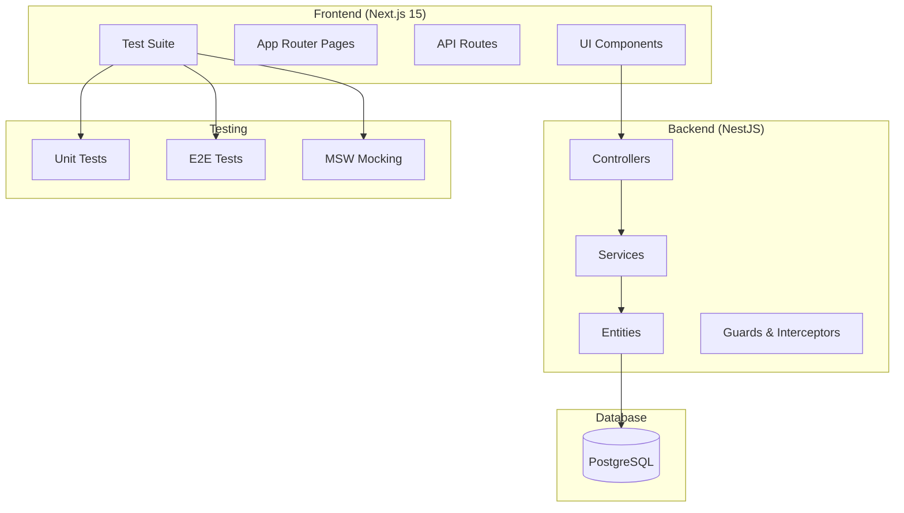
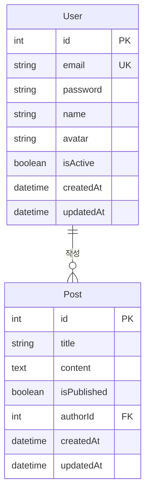

# 시스템 아키텍처

## 전체 아키텍처



## 백엔드 아키텍처 (NestJS)

### 모듈 구조

```
src/
├── modules/
│   ├── auth/          # 인증 모듈
│   ├── users/         # 사용자 관리
│   └── posts/         # 게시글 관리
├── common/            # 공통 기능
│   ├── guards/        # 인증 가드
│   ├── filters/       # 예외 필터
│   ├── interceptors/  # 로깅 인터셉터
│   └── pipes/         # 검증 파이프
└── config/            # 설정 파일
```

### 핵심 디자인 패턴

#### 1. 모듈 기반 아키텍처

- **관심사 분리**: 각 모듈은 독립적인 기능 담당
- **의존성 주입**: NestJS의 DI 컨테이너 활용
- **모듈 간 통신**: 서비스 레이어를 통한 느슨한 결합

#### 2. 계층화 아키텍처

```
Controller → Service → Repository → Database
    ↓           ↓
   DTO      Entity
```

#### 3. 공통 기능 추상화

- **Guards**: 인증/인가 처리
- **Interceptors**: 로깅, 변환, 캐싱
- **Pipes**: 데이터 검증 및 변환
- **Filters**: 예외 처리 및 응답 표준화

### 데이터베이스 설계

#### 엔티티 관계



#### 관계 설정

- **User → Post**: One-to-Many (한 사용자가 여러 게시글 작성)
- **Post → User**: Many-to-One (게시글은 한 명의 작성자)
- **Cascade Delete**: 사용자 삭제 시 관련 게시글도 삭제

## 프론트엔드 아키텍처 (Next.js 15)

### App Router 구조

```
app/
├── layout.tsx         # 루트 레이아웃
├── page.tsx          # 홈페이지
├── showcase/         # 컴포넌트 쇼케이스
└── globals.css       # 전역 스타일
```

### 컴포넌트 아키텍처

```
components/
├── Button/           # 버튼 컴포넌트
│   ├── Button.tsx
│   ├── Button.test.tsx
│   └── index.ts
├── Card/             # 카드 컴포넌트
└── Input/            # 입력 컴포넌트
```

### 핵심 디자인 패턴

#### 1. 컴포넌트 기반 아키텍처

- **재사용성**: 공통 UI 컴포넌트 라이브러리
- **조합성**: 작은 컴포넌트들을 조합하여 복잡한 UI 구성
- **테스트 가능성**: 각 컴포넌트별 독립적인 테스트

#### 2. 관심사 분리

- **UI 컴포넌트**: 순수한 UI 렌더링
- **비즈니스 로직**: 서비스 레이어에서 처리
- **상태 관리**: React의 내장 상태 관리 활용

#### 3. 타입 안전성

- **TypeScript**: 컴파일 타임 타입 검사
- **Props 인터페이스**: 컴포넌트 간 명확한 계약
- **제네릭**: 재사용 가능한 타입 정의

## 테스트 아키텍처

### 테스트 피라미드

```
        E2E Tests (Playwright)
       /                    \
   Integration Tests      Unit Tests
  /                        \
API Tests                Component Tests
```

### 테스트 전략

#### 1. 단위 테스트 (Unit Tests)

- **컴포넌트 테스트**: React Testing Library
- **서비스 테스트**: Jest + NestJS Testing
- **유틸리티 테스트**: 순수 함수 테스트

#### 2. 통합 테스트 (Integration Tests)

- **API 테스트**: Supertest + Jest
- **데이터베이스 테스트**: 실제 DB 연동 테스트
- **MSW 모킹**: API 응답 모킹

#### 3. E2E 테스트 (End-to-End Tests)

- **Playwright**: 실제 브라우저 환경
- **사용자 시나리오**: 전체 사용자 플로우
- **크로스 브라우저**: 다양한 브라우저 지원

## 개발 워크플로우

### 코드 품질 보장

1. **ESLint**: 코드 스타일 및 품질 검사
2. **Prettier**: 코드 포맷팅 자동화
3. **TypeScript**: 타입 안전성 보장
4. **Husky**: Git 훅을 통한 자동 검사

### 테스트 자동화

1. **단위 테스트**: 코드 변경 시 즉시 실행
2. **E2E 테스트**: CI/CD 파이프라인에서 실행
3. **코드 커버리지**: 테스트 커버리지 모니터링
4. **성능 테스트**: Lighthouse를 통한 성능 검사

## 확장성 고려사항

### 백엔드 확장성

- **모듈화**: 새로운 기능을 모듈로 추가
- **마이크로서비스**: 필요시 서비스 분리 가능
- **캐싱**: Redis 등을 통한 성능 최적화
- **로드 밸런싱**: 다중 인스턴스 지원

### 프론트엔드 확장성

- **컴포넌트 라이브러리**: 재사용 가능한 UI 컴포넌트
- **상태 관리**: Redux/Zustand 등 고급 상태 관리
- **코드 분할**: 동적 임포트를 통한 번들 최적화
- **PWA**: Progressive Web App 지원
